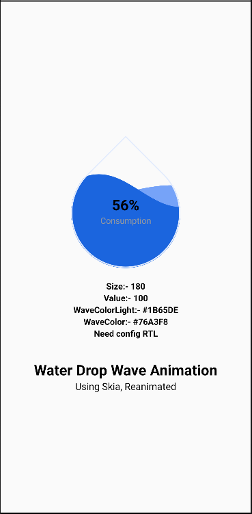

# WaveAnimation

A brief description of what this project does and who it's for

## ScreenShot

## Features

- Change Size of Drop
- Wave height as ver value
- Two wave option
- Colour of Wave
- RTL support

## Color Reference

| Color             | Hex                                                                |
| ----------------- | ------------------------------------------------------------------ |
| Wave Light Color |  #76A3F8 |
| Wave Color |  #1B65DE |
| Default Wave Light Color |  #9398A1 |
| Default Wave Color |  #141516 |

## Demo

https://github.com/IBU-SHI/WaveAnimation/assets/91561445/f8b25f6a-45ef-4b69-b8f7-8811161016e2

